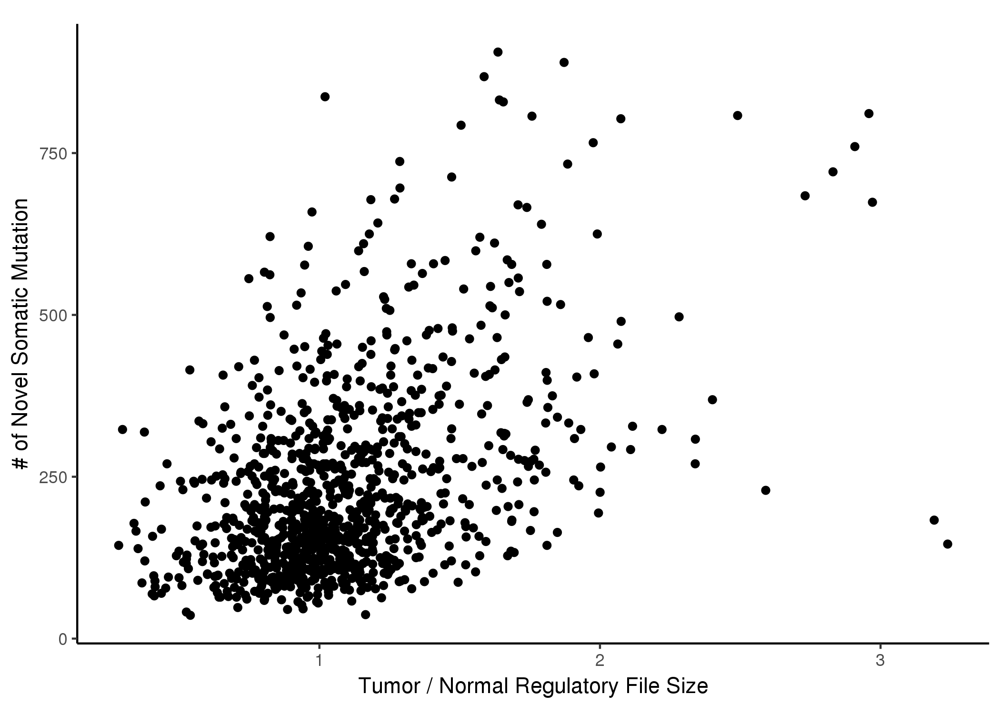
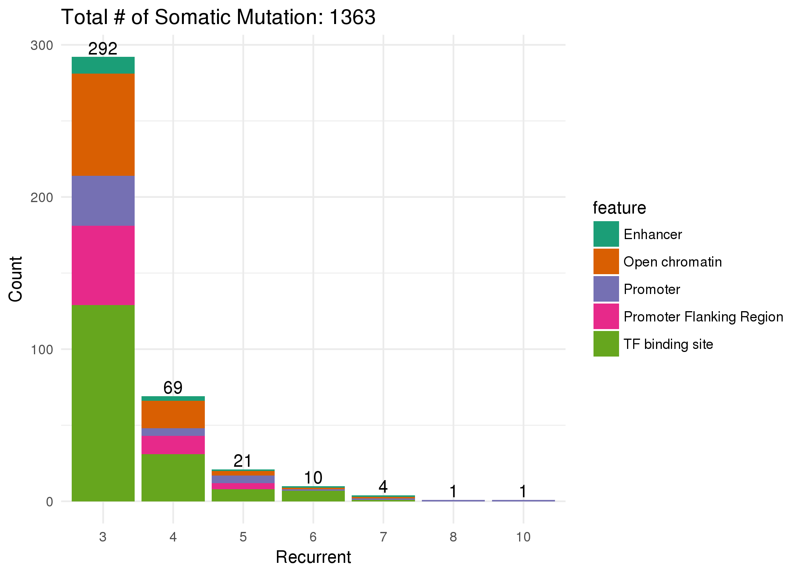
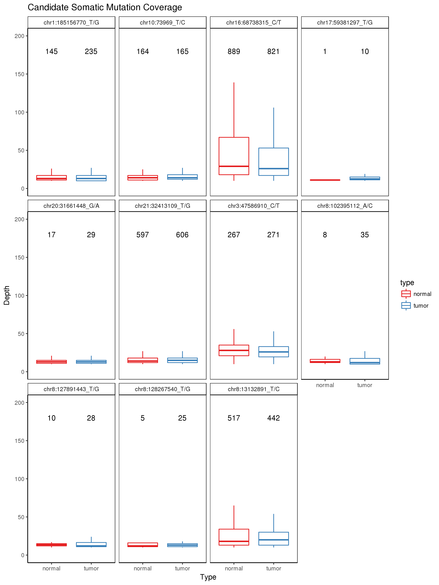
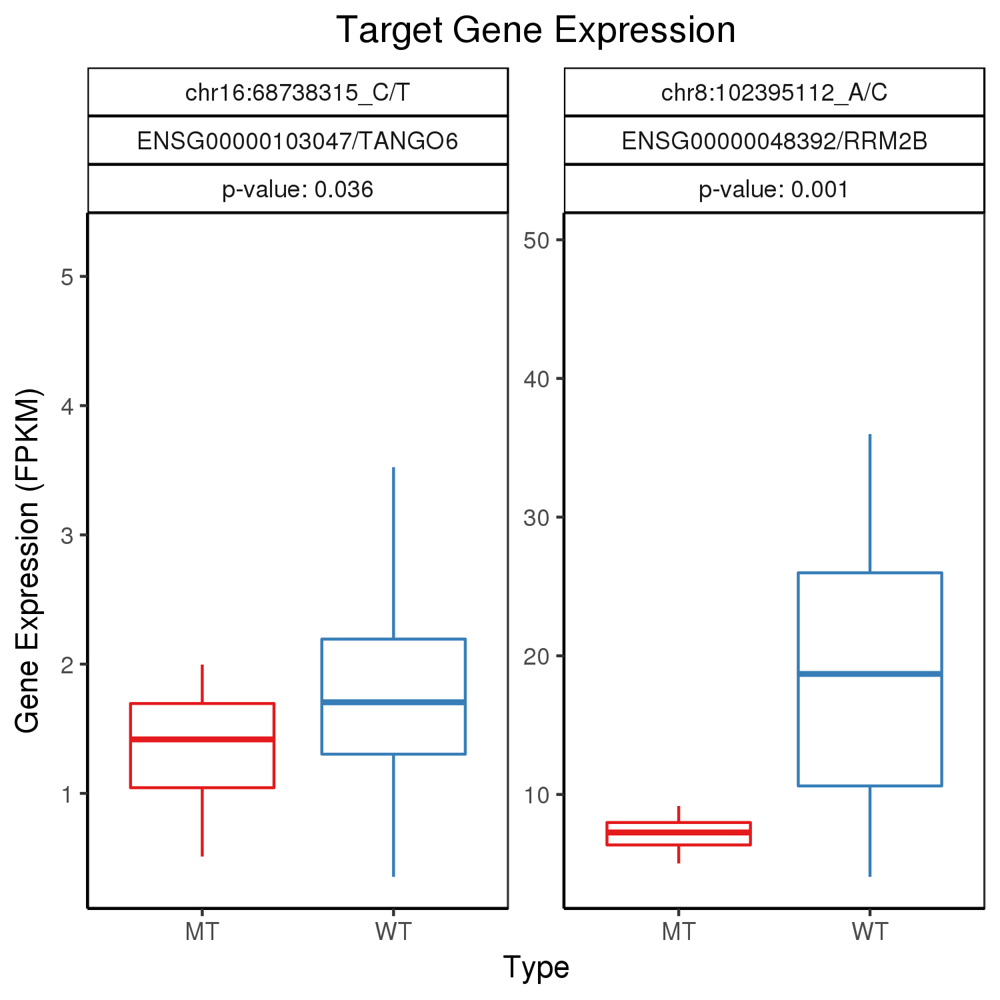
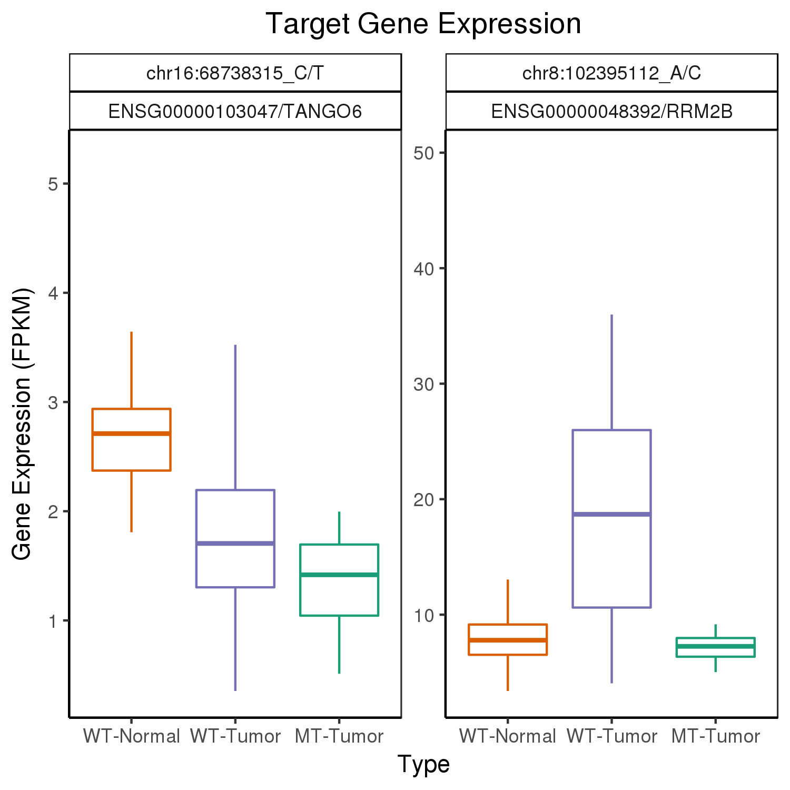
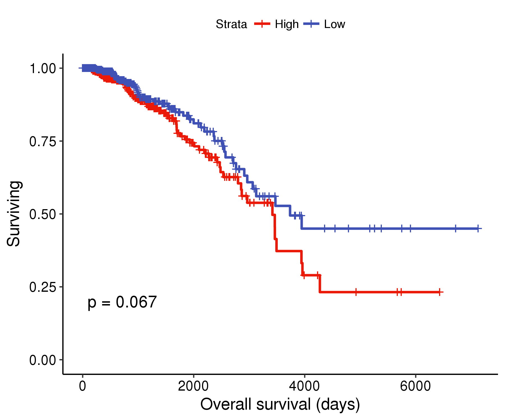

```{r setup, include=FALSE}
knitr::opts_chunk$set(echo = FALSE)
```


# Somatic mutation prioritization
The reason of last findings of PDE4DIP could be false positive are:

1. The somatic mutation is based on $Somatic = mutations_T - mutations_N$. The cretiria  to filter $mutation_T$ and $mutation_N$ are the same DP(reference) >=10, AD(allele depth) >=3.

2. Did not BLAT the sequence. The mutations called from bam reads are based on the correct mapping. The default mapping method **BWA** allow the 3 mismatches in 35bp. mutation in read maybe a mismatch if the read is located in repeat region.

The core prioritization is the mapping DP and AD. To minimize the false positive, set $mutation_T$ (DP >= 10, AD >= 3, MQ >= 20) and $mutation_N$ (DP >= 5, AD >=3, MQ >= 20). These basic critiria can filter out most false positive somatic mutations.

A basic question is why I don't use specialized somatic calling softwares, such as VarScan, SomaticSniper, JSM2 and Strelka. These softwares are based on the enough coverage the same position for the normal tumor pair. When there is no enough coverage either in the normal or tumor, the somatic calling may not good. Besides, the somatic result call by these softwares are not consistent.

## Reads statistics and extracted file size comparison
According to the pipeline, we extracted regulatory reads from bam files based on the Ensembl regulatory build.


Fig. 1 shows that the more reads captured by WXS in the raw bam, the more reads are located in the regulatory region. We can estimate that, about 8% of WXS reads in each bam are located the regulatory regions. According to the Ensembl regulatory build, about 13% of genome are regulatory region. WGS can give us the whole information of 13% regulatory region. But the number of WXS is largely greater than WGS. We can still use 8% of WXS reads to study the regulatory regions.

## GATK calling
We call the mutation from the regulatory bam files extracted from WXS with default by HaplotypeCaller algorithm. 


## Basic filteration and annotation





## Reduce false positive 



## Target gene and gene expression



## Gene expression and survival analysis




# Mutation and regulatory function


# Supplementary tables

* Table 1. Detailed information regarding included TCGA-BRCA including UUID codes for GDC-portal.
* Table 2. Mutation annotation filter.
* Table 3. Candidate mutation coverage.
* Table 4. Mutation target protein coding genes.
* Table 5. TF binds to the mutation point.


