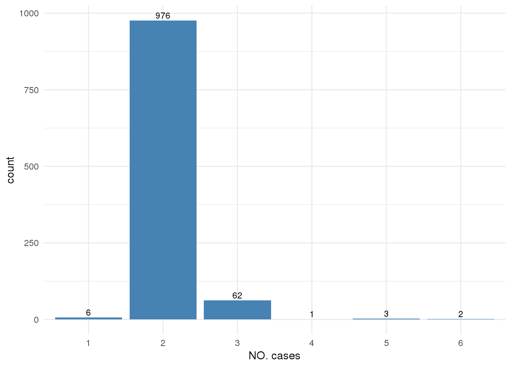
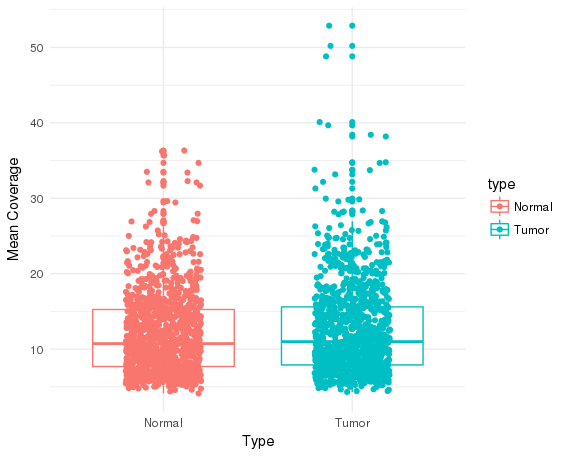
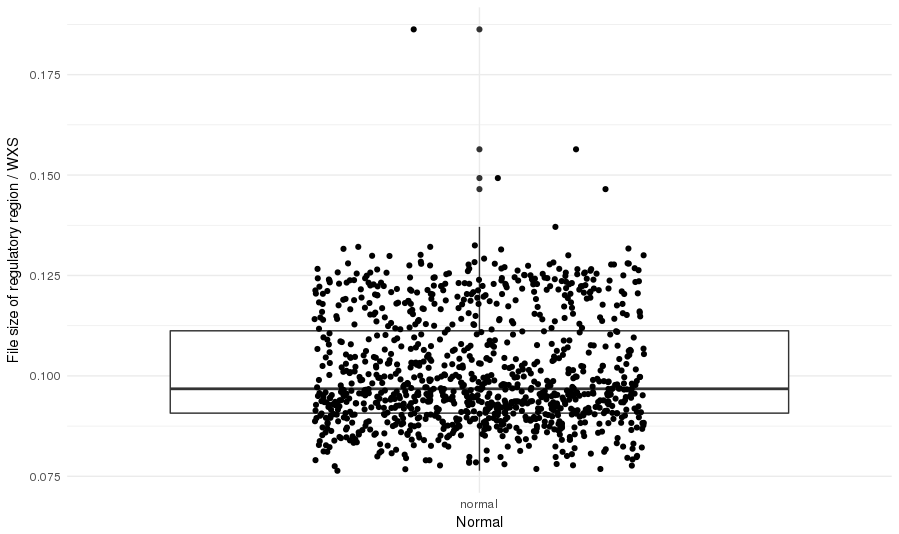
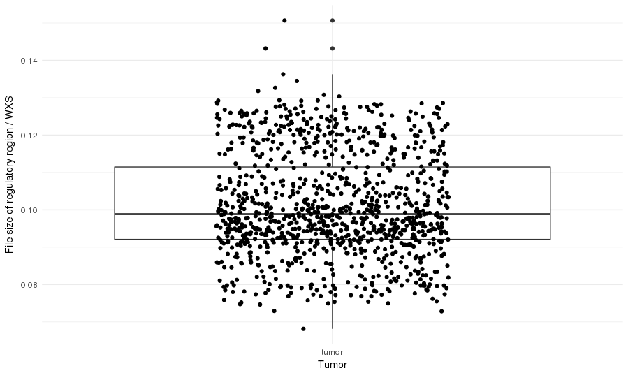
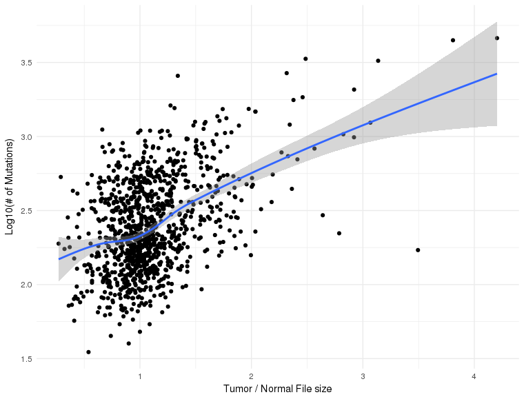
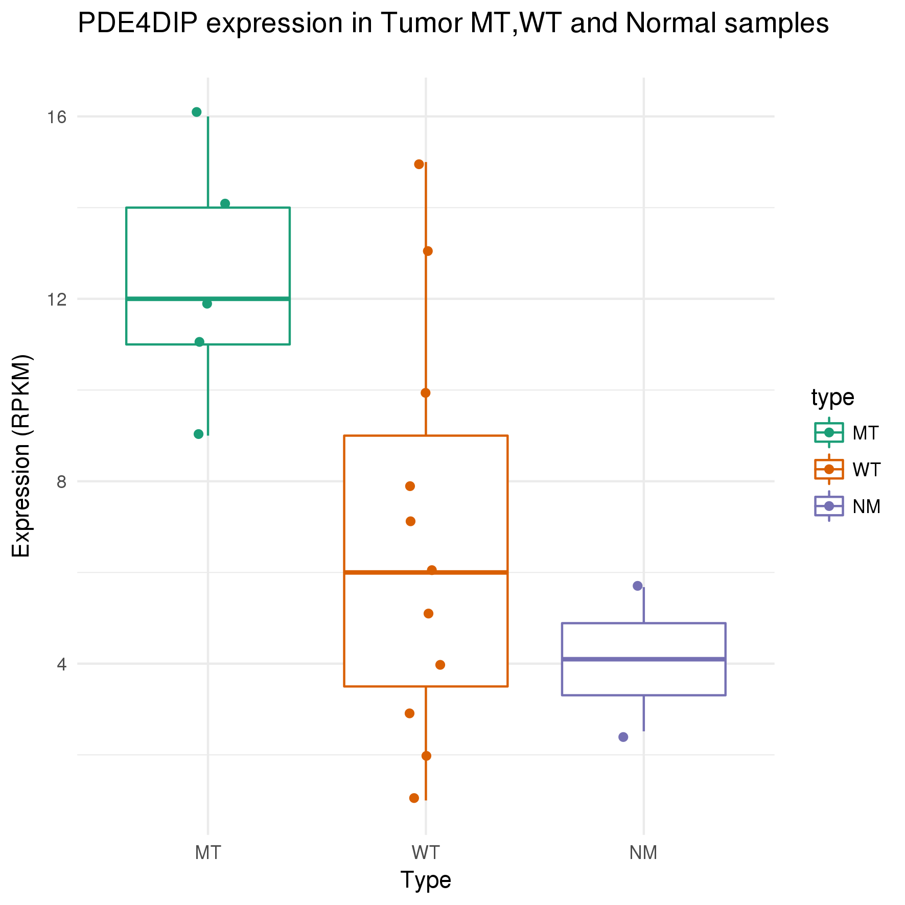

# Backgrounds
hi

## Mutations in promoter research
hi

## WXS capture rate
hi

# Challenges
hi

## Regulatory region
hi

## WXS data statistics

hi

## Somatic calling

hi

# Result
## WXS data
hi

## Candidate mutation
hi

## Mutation target protein coding genes
hi

## Target genes expression

hi

## PDE4DIP
### RegulomeDB
hi

### Motif near PDE4DIP
hi

